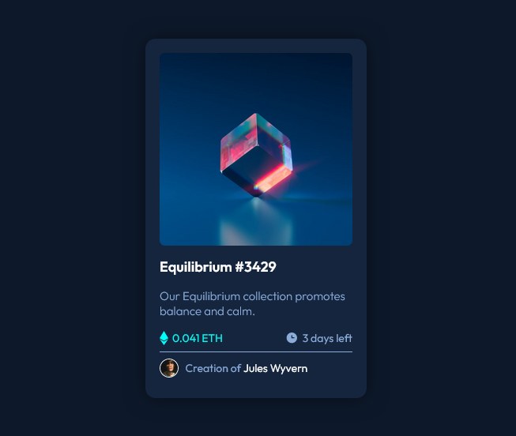

# Frontend Mentor - NFT preview card component solution

This is a solution to the [NFT preview card component challenge on Frontend Mentor](https://www.frontendmentor.io/challenges/nft-preview-card-component-SbdUL_w0U). Frontend Mentor challenges help you improve your coding skills by building realistic projects.

## Table of contents

- [Overview](#overview)
  - [The challenge](#the-challenge)
  - [Screenshot](#screenshot)
  - [Links](#links)
- [My process](#my-process)
  - [Built with](#built-with)
  - [What I learned](#what-i-learned)
- [Author](#author)
- [Acknowledgments](#acknowledgments)

## Overview

### The challenge

Users should be able to:

- View the optimal layout depending on their device's screen size
- See hover states for interactive elements

### Screenshot



### Links

- Solution URL: [Github Repository](https://github.com/HectorKayman/nft-preview-card-component)
- Live Site URL: [Github Pages](https://hectorkayman.github.io/nft-preview-card-component/)

## My process

### Built with

- HTML5
- CSS
- Flexbox

### What I learned

One of the most interesting learnings was, the use of `::after` along with `:hover`, to achieve the desired overlay. Of course there were other ways to achive it, but I found this to be the most worthwhile to apply, in terms of the less learned during the whole process.

```css
.product::after {
  /* Inserts "icon view" image after the content of ".product" element. */
  content: url(./images/icon-view.svg);
  background: hsl(180, 100%, 50%, 0.5);

  /* Positions the pseudo-element absolutely within the boundaries of ".product". */
  position: absolute;

  /* Positions the pseudo-element at all edges (top, right, bottom, left) of ".product" element, covering it completely. */
  inset: 0;
  display: flex;
  justify-content: center;
  align-items: center;
  opacity: 0;

  /* Adds a smooth transition effect */
  transition: all 0.25s ease;
}

/* Changes the opacity of the pseudo-element to be visible when ".product" element is hovered over. */
.product:hover::after {
  opacity: 1;
}
```

### Useful resources

- [Kevin Powell's tutorial on creating directionally aware hover effects](https://www.youtube.com/watch?v=G_h2pGZcOzc) actually inspired me to use `::after` for the overlay.
- [This Stack Overflow post](https://stackoverflow.com/questions/71103867/display-an-image-on-top-of-another-css-using-hover) had the full solution to the given problem so I didn't want to copy it.

## Author

- Frontend Mentor - [@HectorKayman](https://www.frontendmentor.io/profile/HectorKayman)

## Acknowledgments

Kevin Powell on Youtube, as always.
